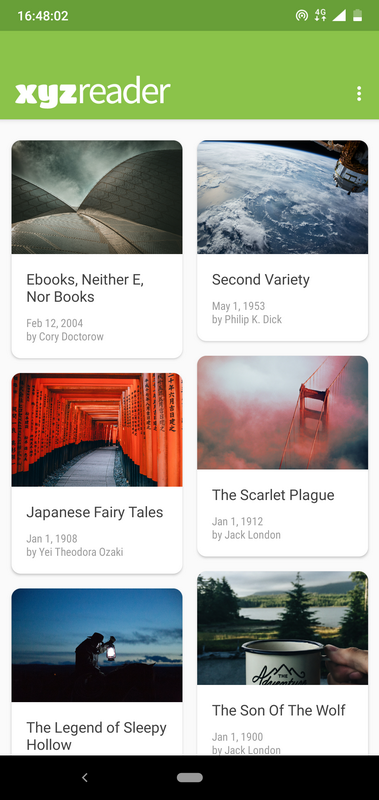
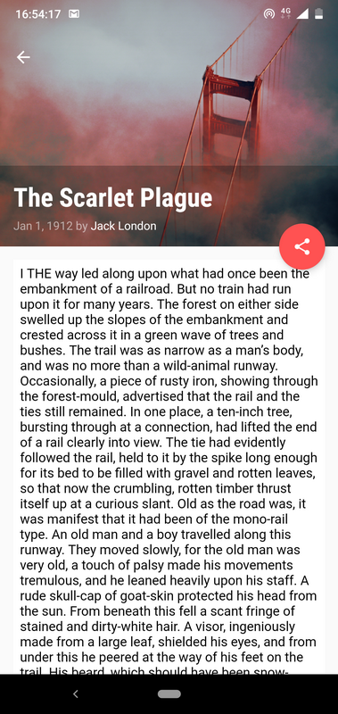

# XYZReader-and
XYZ Reader lets you to read books. The books are loaded from a server and is stored in a local database. It focuses on complying Material Design Specifications. And uses standard animations, styles, themes &amp; components. 

This my end lesson project exercise in Android Developer Nanodegree by Google from Udacity which I got as a part of Google India Challenge Scholarship 2018

 
